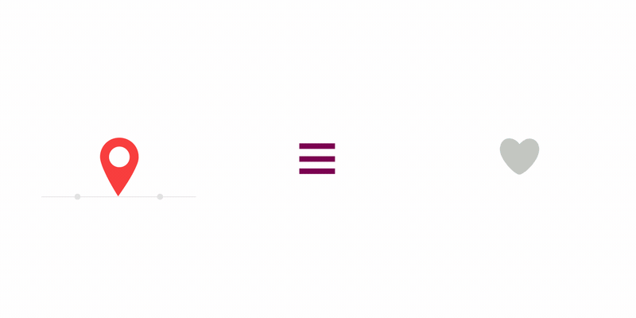

Lottie for React Native, [iOS](https://github.com/airbnb/lottie-ios), and [Android](https://github.com/airbnb/lottie-android)
===

[](https://www.npmjs.com/package/lottie-react-native) [](https://www.npmjs.com/package/lottie-react-native) [](https://travis-ci.org/airbnb/lottie-react-native)

Lottie component for React Native (iOS and Android)

Lottie is a mobile library for Android and iOS that parses [Adobe After Effects](http://www.adobe.com/products/aftereffects.html) animations exported as JSON with [bodymovin](https://github.com/bodymovin/bodymovin) and renders them natively on mobile!

For the first time, designers can create **and ship** beautiful animations without an engineer painstakingly recreating it by hand.

# Getting Started

Get started with Lottie by installing the node module with yarn or npm:

```
yarn add lottie-react-native
```
or
```
npm i --save lottie-react-native
```

## iOS

Use `react-native link` to add the library to your project:

```
react-native link lottie-ios
react-native link lottie-react-native
```

After this, open the Xcode project configuration and add the `Lottie.framework` as `Embedded Binaries`.

## Android

For android, you can `react-native link` as well:

```
react-native link lottie-react-native
```

# Usage

Lottie's animation progress can be controlled with an `Animated` value:

```
import React from 'react';
import { Animated, Easing } from 'react-native';
import LottieView from 'lottie-react-native';

export default class BasicExample extends React.Component {
  constructor(props) {
    super(props);
    this.state = {
      progress: new Animated.Value(0),
    };
  }

  componentDidMount() {
    Animated.timing(this.state.progress, {
      toValue: 1,
      duration: 5000,
      easing: Easing.linear,
    }).start();
  }

  render() {
    return (
      <LottieView source={require('../path/to/animation.json')} progress={this.state.progress} />
    );
  }
}
```

Additionally, there is an imperative API which is sometimes simpler.

```
import React from 'react';
import LottieView from 'lottie-react-native';

export default class BasicExample extends React.Component {
  componentDidMount() {
    this.animation.play();
    // Or set a specific startFrame and endFrame with:
    this.animation.play(30, 120);
  }

  render() {
    return (
      <LottieView
        ref={animation => {
          this.animation = animation;
        }}
        source={require('../path/to/animation.json')}
      />
    );
  }
}
```

# View more documentation, FAQ, help, examples, and more at [airbnb.io/lottie](http://airbnb.io/lottie/react-native/react-native.html)




